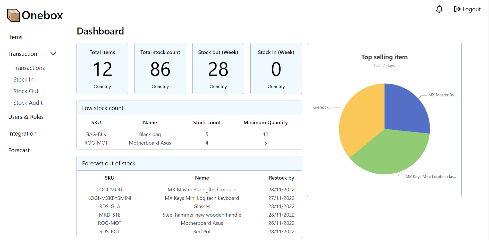
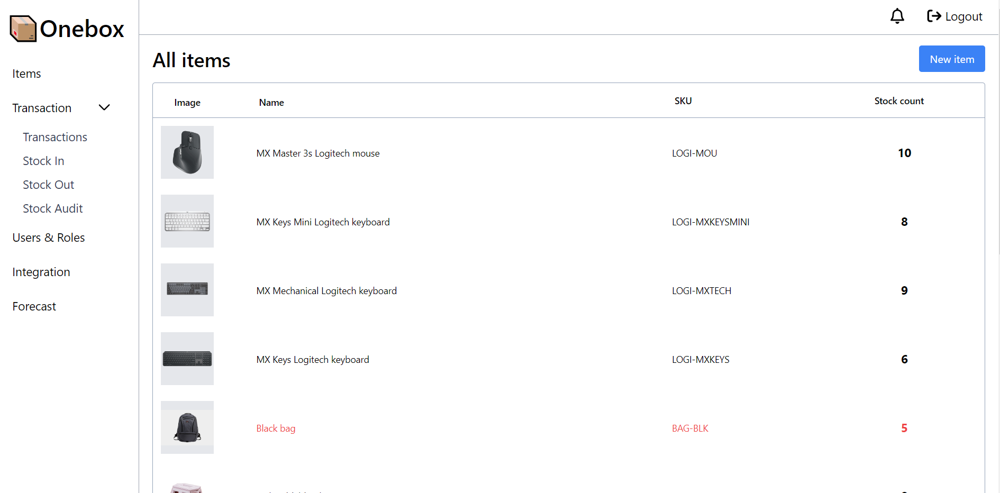
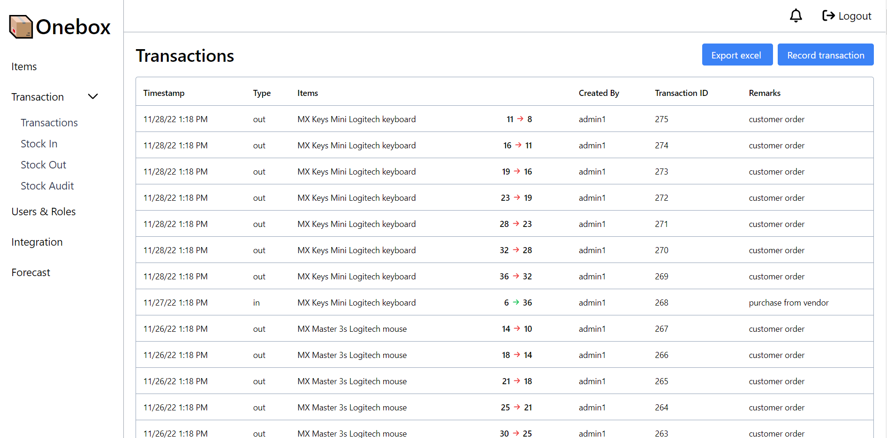
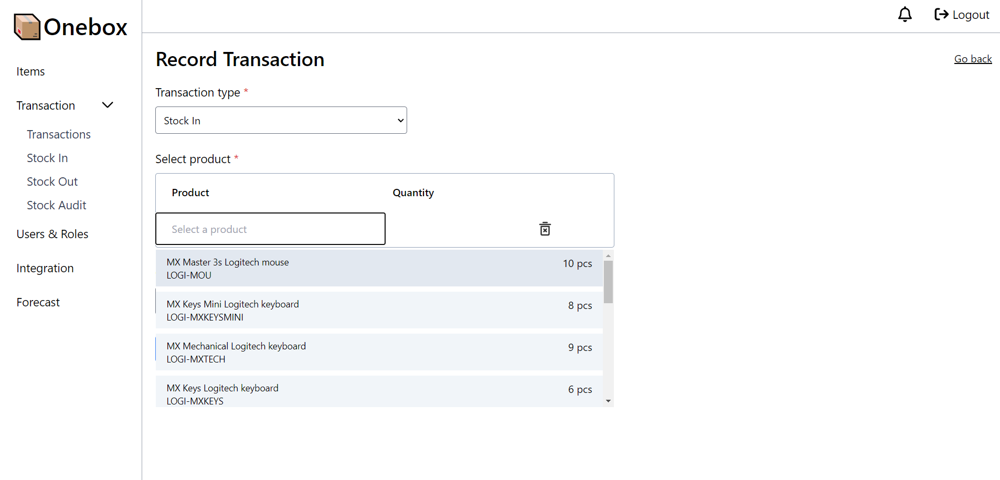
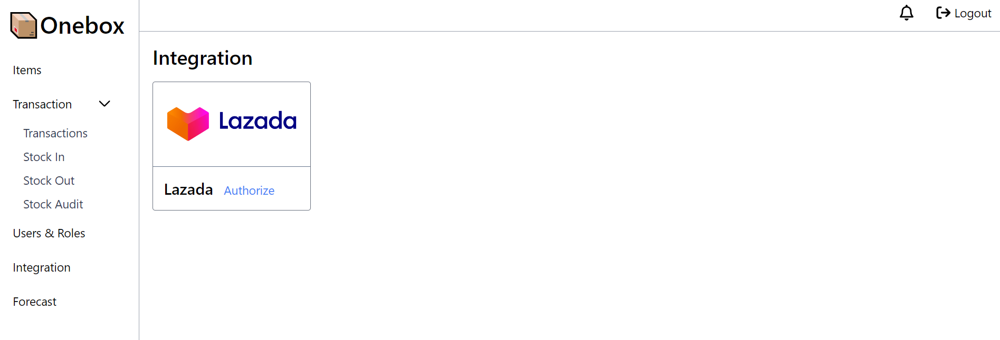
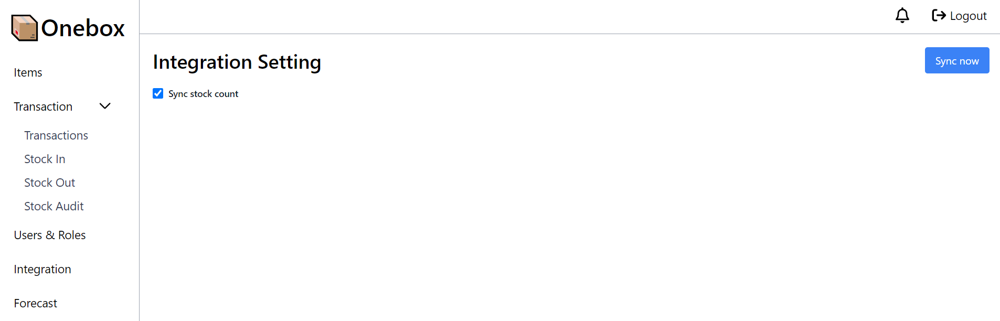
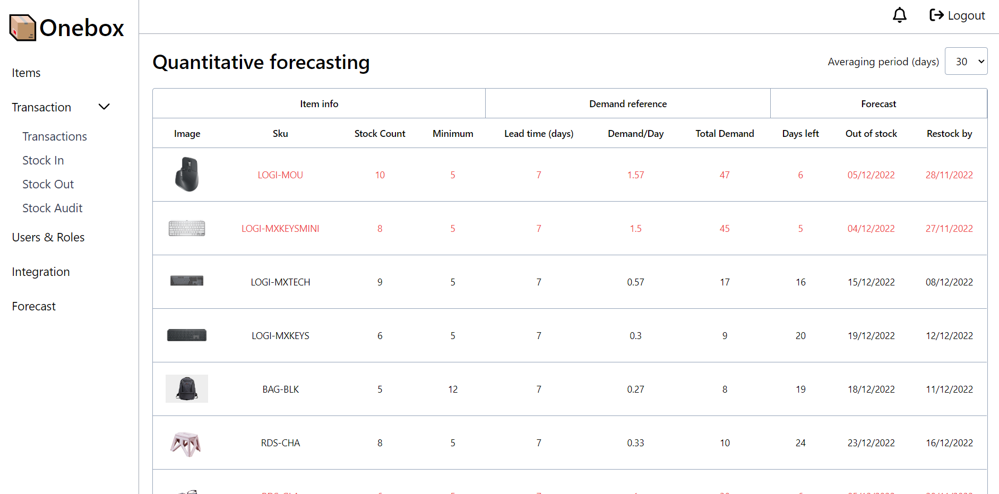
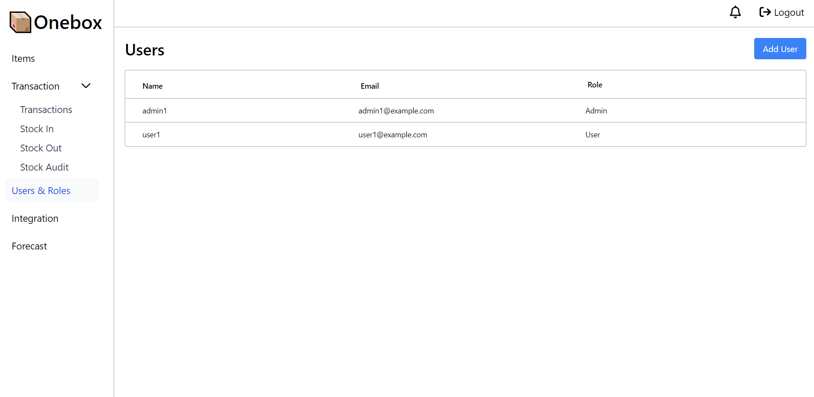

# Onebox
https://oneboxapp.tech/(https://oneboxapp.tech/)
## Local setup
```
git clone https://github.com/lingxiao14122/onebox.git
cd onebox
composer install
cp .env.example .env
php artisan key:generate
create database in mysql
npm install
symbolic link php artisan storage:link
php artisan migrate:fresh --seed
```

## Running
```
npm run build
./mailhog (check .env port 1025)
php artisan queue:listen
```

## Screenshots











